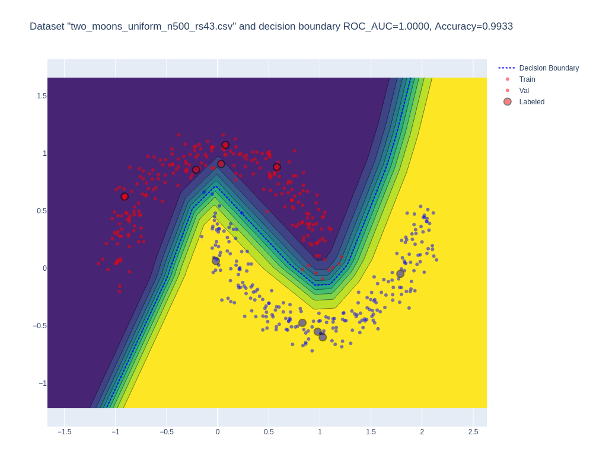
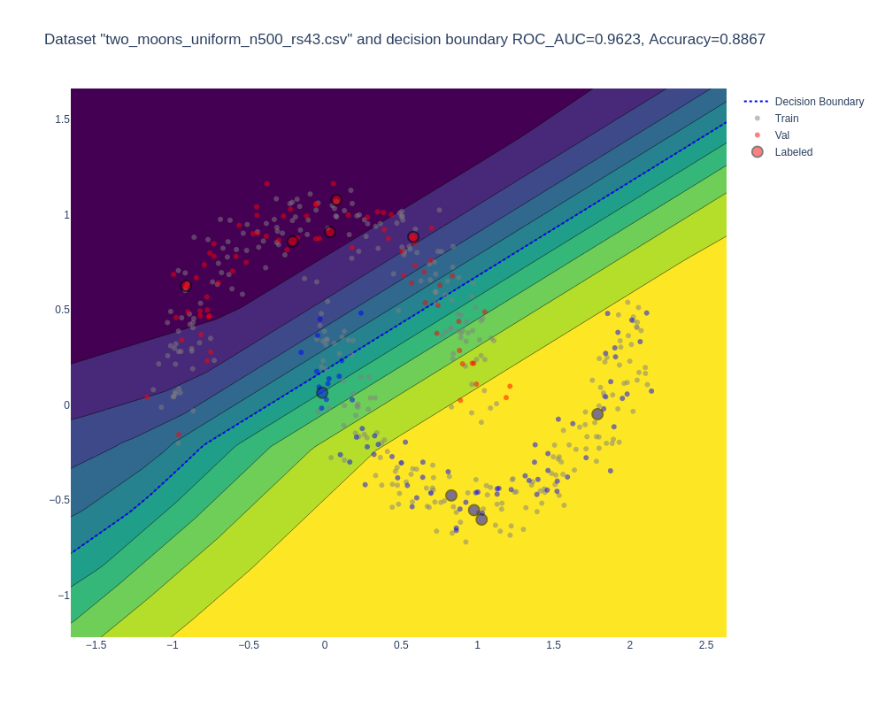
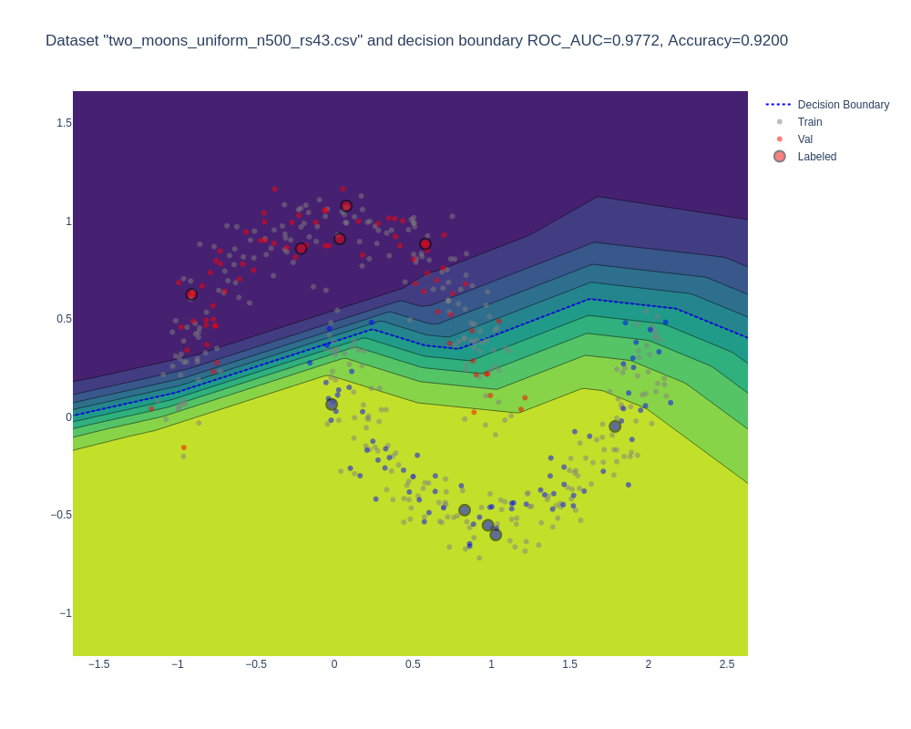

# Semi-Supervised Learning with Mean Teacher on Two Moons Dataset

## Overview
This project explores the implementation of Semi-Supervised Learning (Semi-SL) using the Mean Teacher approach on the Two Moons dataset. The goal is to demonstrate the effectiveness of semi-supervised learning techniques, especially in scenarios with limited labeled data.

## TODO List and Project Progress
- [x] **Generate Fixed Datasets:** 
  - Created datasets with fixed splits for training, labeled, and unlabeled data for Semi-SL and Self-SL.
  - Variants generated:
    - TwoMoons_2Dto1D_uniform
    - TwoMoons_2Dto1D_single_gaussian
    - TwoMoons_2Dto1D_two_gaussians
- [ ] **Augmentation Function:**
  - What transformation is considered augmentation to preserve class belonging?
- [x] **Visualize Datasets:**
  - Implemented visualization of the datasets using Plotly, including decision boundaries.
- [x] **Implement Vanilla Supervised Learning (SL) as a Baseline:**
  - Using all train data as labeled.
  - Using only a small part (5 per each of 2 classes = 10) as labeled data.
  - Metric calculations.
  - Visualization of results.
- [x] **Implement Mean-Teacher Approach for Semi-SL:**
  - Utilized 10 labeled data points and 340 unlabeled data points.

## Experiment Results
1. **Baseline Model (Supervised Learning on Full Training Data):**
   - Trained on 350 data points.
   - ROC AUC: 1.000, Accuracy: 0.993.
   - Visualization: 
   
   
2. **Reference Model (Supervised Learning on Small Labeled Subset):**
   - Trained on 10 data points.
   - ROC AUC: 0.962, Accuracy: 0.887.
   - Visualization: 
   

3. **Mean Teacher Model (Semi-Supervised Learning):**
   - Trained on 10 labeled data points and 340 unlabeled data points.
   - ROC AUC: 0.977, Accuracy: 0.920.
   - Visualization: 
   

These results demonstrate the potential of Semi-Supervised Learning approaches, particularly the Mean Teacher model, in leveraging unlabeled data to achieve higher performance compared to purely supervised learning with limited labeled data.

## Note
All code and this README file were produced using OpenAI's GPT-4V.
